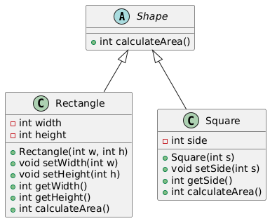

# Liskov Substitution Principle (LSP)

The Liskov Substitution Principle (LSP) is one of the five SOLID principles of object-oriented design. It asserts that, a subclass should not override the behavior of the superclass in a way that violates the expectations established by the superclass's methods.

## Moto

**Objects of a superclass should be replaceable with objects of a subclass without affecting the correctness of the program.**

## Example Violating LSP

1. In practical sense, a `Square` is a `Rectangle`. Indeed it is a specialization of a `rectangle`. The `"is a"` makes you want to model this with `inheritance`. However if in code you made `Square` derive from `Rectangle`, then a `Square` should be usable anywhere you expect a `Rectangle`. This makes for some strange behavior.

2. Imagine you had `SetWidth` and `SetHeight` methods on your `Rectangle` base class; this seems perfectly logical. However if your `Rectangle` reference pointed to a `Square`, then `SetWidth` and `SetHeight` doesn't make sense because setting one would change the other to match it. In this case `Square` fails the Liskov Substitution Test with `Rectangle`.

3. The abstraction of having `Square` inherit from `Rectangle` is a bad one.

### Class Diagram - Violating LSP


### Code - Violating LSP

```cpp
#include <iostream>

class Rectangle {
protected:
    int width, height;
public:
    void setWidth(int w) {
        width = w;
    }
    void setHeight(int h) {
        height = h;
    }
    int getWidth() const {
        return width;
    }
    int getHeight() const {
        return height;
    }
    int calculateArea() const {
        return width * height;
    }
};

class Square : public Rectangle {
public:
    //violates the LSP
    void setWidth(int w) override {
        width = height = w;
    }
    void setHeight(int h) override {
        width = height = h;
    }
};

void processRectangle(Rectangle& rect) {
    rect.setWidth(5);
    rect.setHeight(10);
    std::cout << "Expected Area = 50, Got Area = " << rect.calculateArea() << std::endl;
}

int main() {
    Rectangle rect;
    processRectangle(rect);

    Square sq;
    processRectangle(sq);  // Violates LSP, Expected Area = 50, Got Area = 100

    return 0;
}
```

## Example Correcting LSP

1. To adhere to the `LSP`, `Square` should not inherit from `Rectangle` if it cannot adhere to the `Rectangle` contract. Instead, we might design these classes separately or use a different design pattern.
2. We can implement, `Rectangle` and `Square` as separate classes both inheriting from an abstract `Shape` class, each implementing the `calculateArea()` method independently, adhering to the `LSP`.

### Class Diagram Corrected LSP



### Code Corrected LSP

```cpp
#include <iostream>

class Shape {
public:
    virtual int calculateArea() const = 0;  // Pure virtual function
    virtual ~Shape() = default;
};

class Rectangle : public Shape {
protected:
    int width, height;
public:
    Rectangle(int w, int h) : width(w), height(h) {}

    void setWidth(int w) {
        width = w;
    }
    void setHeight(int h) {
        height = h;
    }
    int getWidth() const {
        return width;
    }
    int getHeight() const {
        return height;
    }
    int calculateArea() const override {
        return width * height;
    }
};

class Square : public Shape {
private:
    int side;
public:
    Square(int s) : side(s) {}

    void setSide(int s) {
        side = s;
    }

    int getSide() const{
        return side;
    }

    int calculateArea() const override {
        return side * side;
    }
};

void processShape(Shape& shape) {
    std::cout << "Area = " << shape.calculateArea() << std::endl;
}

int main() {
    Rectangle rect(5, 10);
    processShape(rect);

    Square sq(5);
    processShape(sq);

    return 0;
}
```
