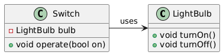
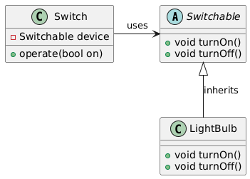

# Dependency Inversion Principle (DIP)

The Dependency Inversion Principle (DIP) is one of the five SOLID principles of object-oriented design. It states that the design should be such that high-level components (which contain complex logic) depend on abstractions (e.g., interfaces), rather than on low-level components (which handle the specifics).

## Moto

**High-level modules should not depend on low-level modules. Both should depend on abstractions. Abstractions should not depend on details. Details should depend on abstractions.**

## Example Violating DIP

1. Consider the example of a High-Level Module (Abstract and Generic) `Switch` and Low-Level Module (Concrete and Specific) `LightBulb`.
2. In this example, the `LightBulb` class (low-level module) is directly used by the `Switch` class (high-level module), which violates the `DIP` because the high-level module depends on a low-level module directly.

### Class Diagram Violating DIP



### Code Violating DIP

```cpp
#include <iostream>

class LightBulb {
public:
    void turnOn() {
        std::cout << "LightBulb turned on" << std::endl;
    }
    void turnOff() {
        std::cout << "LightBulb turned off" << std::endl;
    }
};

class Switch {
private:
    LightBulb bulb;
public:
    void operate(bool on) {
        if (on) {
            bulb.turnOn();
        } else {
            bulb.turnOff();
        }
    }
};

int main() {
    Switch sw;
    sw.operate(true);
    sw.operate(false);

    return 0;
}
```

## Example Correcting DIP

1. To adhere to the `DIP`, we introduce an abstraction `Switchable` that both `Switch` and `LightBulb` depend on. This allows the `Switch` class to operate on any `Switchable` object, making it independent of the specific `LightBulb` implementation.
2. Using this we can also extend the usage of `Switch` class to more specific classes like `Fan`, `TubeLight` etc.

### Class Diagram Corrected DIP



### Code Corrected DIP

```cpp
#include <iostream>

class Switchable {
public:
    virtual void turnOn() = 0;
    virtual void turnOff() = 0;
    virtual ~Switchable() = default;
};

class LightBulb : public Switchable {
public:
    void turnOn() override {
        std::cout << "LightBulb turned on" << std::endl;
    }
    void turnOff() override {
        std::cout << "LightBulb turned off" << std::endl;
    }
};

class Switch {
private:
    Switchable& device;
public:
    Switch(Switchable& dev) : device(dev) {}
    
    void operate(bool on) {
        if (on) {
            device.turnOn();
        } else {
            device.turnOff();
        }
    }
};

int main() {
    LightBulb bulb;
    Switch sw(bulb);
    
    sw.operate(true);
    sw.operate(false);

    return 0;
}
```